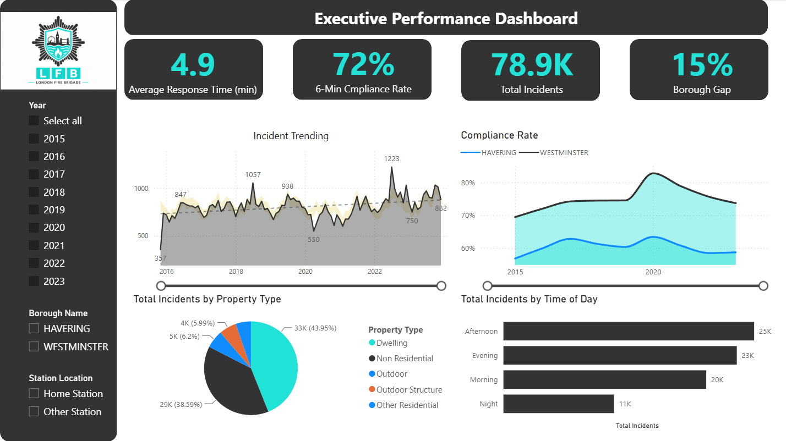
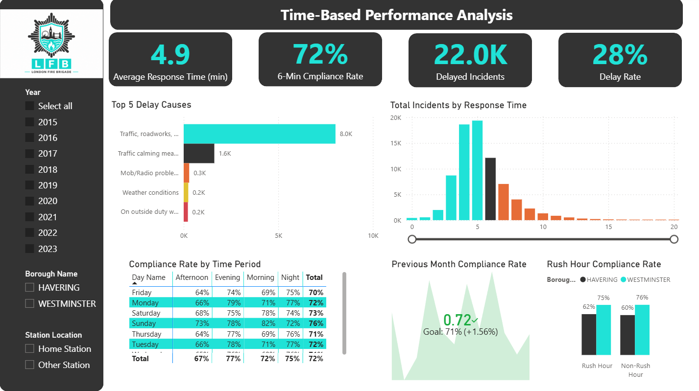
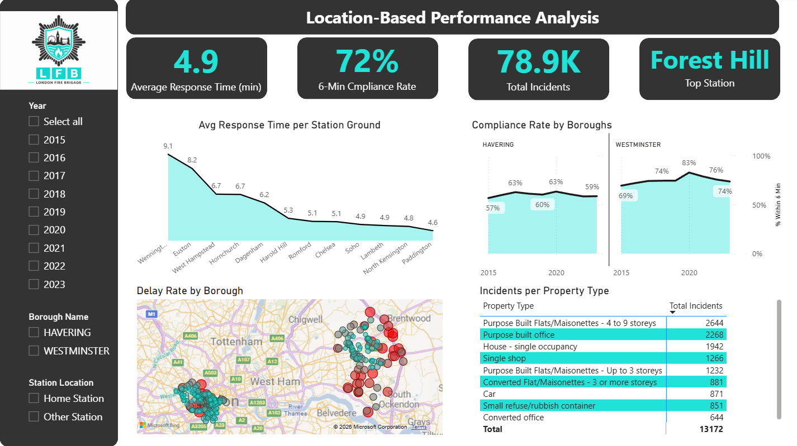
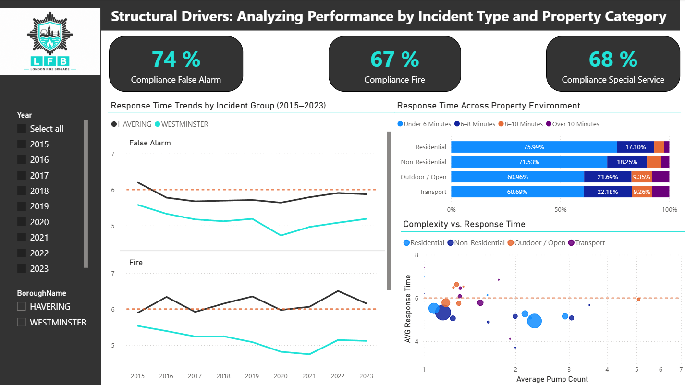
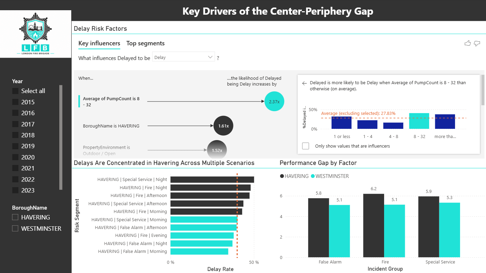

# 1. London Fire Brigade (LFB) Response Time Project

**1.1 Set up the Project Goal**

The goal is to analyse how quickly the LFB responds to incidents.

Scope of Analysis:

- **Mobilisation time**: how long it takes to dispatch a fire engine.
- **Response time:** how long it takes to arrive at the incident

Key questions to be answered:

- How has response time changed over the years?
- Which boroughs have the longest response times?
- Which incident types take longer to respond to?
- Are response times improving or worsening?

**1.2. Analyse Two Datasets**

Dataset 1. LFB Incident Records

Contains: (incident details)

- Incident date
- Location (borough)
- Incident type
- Property type
- Number of vehicles (pumps)

Dataset 2. LFB Mobilisation Records

Contains: (response time analysis)

- Fire engine dispatched
- Station location
- mobilisation time
- arrival time
- response time

# 2. Structure of the Project

**Step 1. Data Exploration**

- Loading the datasets.
- Checking structure/columns.
- Checking data types
- Checking missing values.

**Step 2. Data Cleaning**

- Converting dates/times
- Removing missing response times

**Step 3. Merge the Datasets**

To combine incident information + mobilisation times using:

- Primary Key: Incident Number
- Foreign Key: Mobilisation Number

**Step 4. Data Visualisation**

Main tools: Python (Matplotlib / Seaborn) and Power BI (Report view).

**DataViz Objects:**

- Response Time over Years
- Response Time by Borough
- Incident Types

**Step 5. Data Analysis Objects**

**1️. Response time trend:**

Is response time increasing or decreasing since 2015?

**2.Borough comparison:**

Which boroughs have the fastest/slowest response?

**3️. Incident type comparison (max/min):**

Example types: Fire, False alarm, Special service…

# 3. Main Contribution to the Project

The project was conducted collaboratively across all stages:

- Data preprocessing
- Exploratory analysis
- KPI development
- Dashboard design
- Interpretation of results

The main contribution focused on:

- Developing the dashboard structure and storytelling
- Creating advanced Power BI visualisations
- Designing KPIs and DAX measures
- Translating technical findings into operational insights

Particular attention was given to transforming complex operational data into a clear and decision-oriented analytical narrative.

# 4. Results Obtained and Benchmark Comparison

The benchmark used throughout the project was the London Fire Brigade’s 6-minute response target.

The analysis showed:
- Westminster consistently outperforms Havering
- Havering exhibits lower compliance rates and longer response times
- Delays cluster in specific geographic and operational contexts
- 
The dashboard successfully identified:

- Temporal stress periods
- Geographic bottlenecks
- High-risk scenarios
- Structural operational inefficiencies

