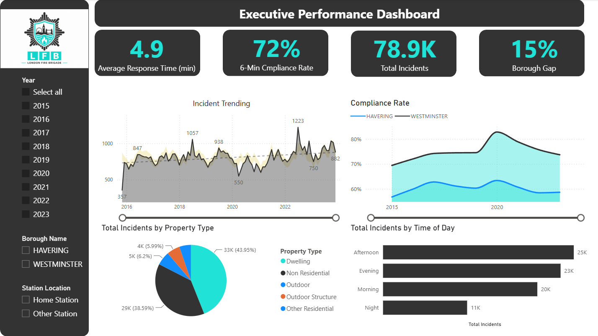
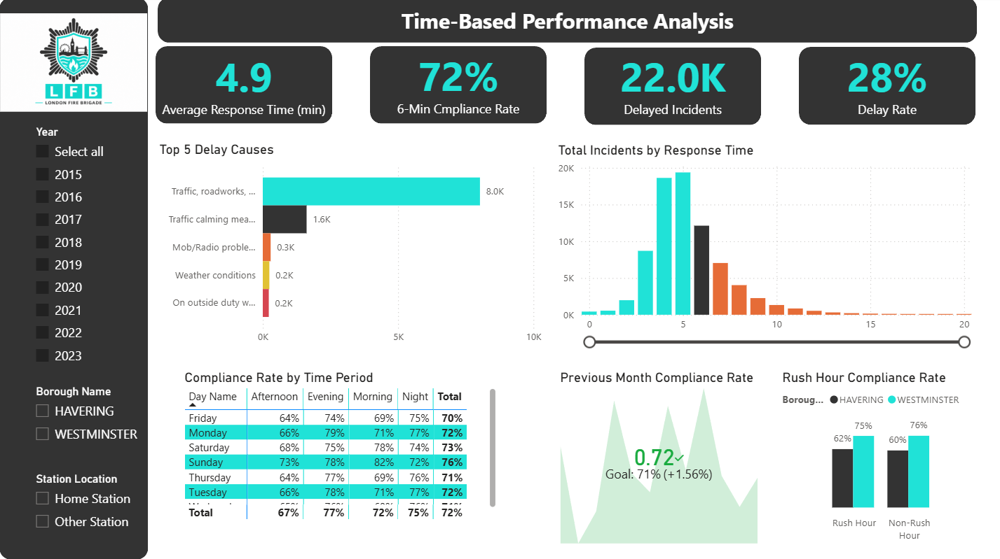
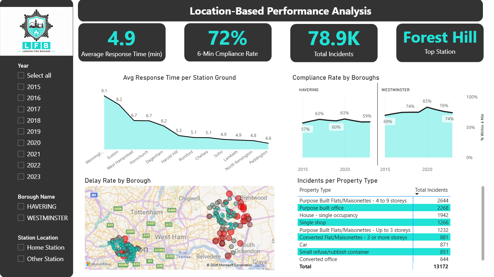
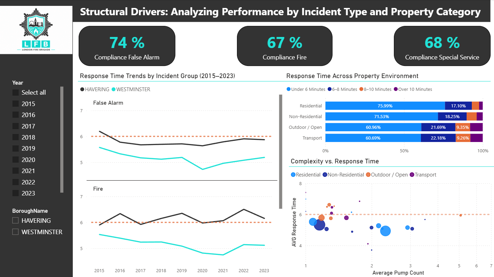
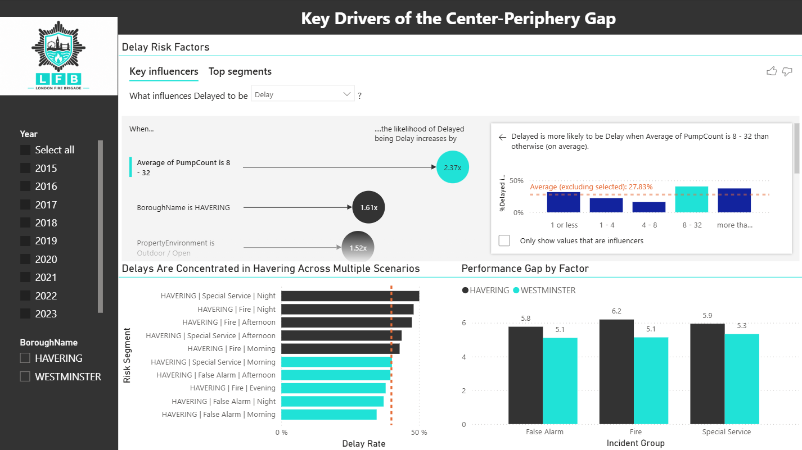

# 🚒 London Fire Brigade (LFB) Response Time Analysis


An end-to-end data analytics project that investigates **London Fire Brigade emergency response performance** by combining incident and mobilisation datasets. The project leverages **Python** for data preparation and exploratory analysis and **Power BI** for interactive dashboarding and business intelligence.

---

# 📖 Table of Contents

- [Project Overview](#project-overview)
- [Project Objectives](#project-objectives)
- [Datasets](#datasets)
- [Project Workflow](#project-workflow)
- [Dashboard & Visualizations](#dashboard--visualizations)
- [Key Findings](#key-findings)
- [Tools & Technologies](#tools--technologies)
- [Project Contribution](#project-contribution)
- [Repository Structure](#repository-structure)
- [Author](#author)

---

# 📌 Project Overview

The London Fire Brigade aims to respond to emergencies as quickly as possible. This project analyzes operational data to understand response performance, identify bottlenecks, and discover patterns that influence emergency response times.

The analysis focuses on two critical metrics:

- 🚒 **Mobilisation Time** – Time required to dispatch a fire engine after receiving an emergency call.
- ⏱️ **Response Time** – Time required for the dispatched vehicle to arrive at the incident location.

The project combines multiple datasets to build an interactive Power BI dashboard for operational monitoring and decision-making.

---

# 🎯 Project Objectives

This analysis answers the following business questions:

- How have response times changed over the years?
- Which London boroughs experience the longest response times?
- Which incident types require the longest response?
- Are response times improving or deteriorating over time?
- Which operational factors contribute to delayed responses?

---

# 📂 Datasets

## Dataset 1 — LFB Incident Records

Source:
https://data.london.gov.uk/dataset/london-fire-brigade-incident-records-em8xy

Contains information about each emergency incident, including:

- Incident Number
- Incident Date
- Borough
- Property Type
- Incident Type
- Number of Fire Engines (Pumps)
- Location Information

---

## Dataset 2 — LFB Mobilisation Records

Source:
https://data.london.gov.uk/dataset/london-fire-brigade-mobilisation-records-24r65

Contains operational response information, including:

- Mobilisation Number
- Fire Station
- Dispatch Time
- Arrival Time
- Mobilisation Time
- Response Time

---

# 🔄 Project Workflow

## 1. Data Exploration

- Import datasets
- Inspect columns and data types
- Identify missing values
- Understand dataset relationships

---

## 2. Data Cleaning

- Convert date and time formats
- Handle missing values
- Remove invalid records
- Standardize categorical variables

---

## 3. Data Integration

The datasets were merged using relational keys to create a unified analytical model.

- **Primary Key:** Incident Number
- **Foreign Key:** Mobilisation Number

---

## 4. Exploratory Data Analysis (EDA)

Python was used to investigate trends and distributions, including:

- Response time trends
- Incident frequency
- Borough comparisons
- Incident type analysis
- Distribution of mobilisation times

---

## 5. Dashboard Development

Power BI was used to build an interactive dashboard featuring:

- Executive KPI cards
- Year-over-year response trends
- Borough performance comparison
- Incident type analysis
- Property type breakdown
- Interactive slicers and filters

---

# 📊 Dashboard & Visualizations

The dashboard includes the following analytical views:

- 📈 Response Time Trends
- 🗺️ Geographical Analysis
- 🚒 Incident & Property Analysis
- 📊 Key Performance Indicators (KPIs)
- 🔍 Operational Drivers

---

# 🔍 Key Findings

Using the London Fire Brigade's **6-minute response target** as the benchmark, the analysis revealed:

- Westminster consistently achieves faster response times than Havering.
- Havering records the lowest compliance with the response target.
- Certain incident types are associated with longer response times.
- Response delays are concentrated in specific boroughs and operational scenarios.
- Geographic and temporal patterns indicate potential resource allocation challenges.

The dashboard enables stakeholders to identify:

- Peak operational periods
- Geographic bottlenecks
- High-risk incident categories
- Areas requiring operational improvement

---

# 🛠 Tools & Technologies

- Python
- Pandas
- NumPy
- Matplotlib
- Seaborn
- Jupyter Notebook
- Power BI
- DAX
- Power Query

---

# 👥 Project Contribution

This project was completed collaboratively across all stages of the analytics lifecycle, including:

- Data preprocessing
- Exploratory data analysis
- KPI development
- Dashboard design
- Business interpretation

### My primary contributions

- Designed the Power BI data model
- Developed interactive dashboards
- Created DAX measures and KPIs
- Built analytical storytelling and dashboard navigation
- Translated analytical findings into business insights

The focus was on transforming complex operational data into a clear, actionable, and decision-oriented reporting solution.

---

# 📁 Repository Structure

```
London-Fire-Brigade-Response-Time-Analysis
│
├── data/
│   ├── raw/
│   └── processed/
│
├── notebooks/
│
├── powerbi/
│
├── images/
│
├── README.md
│
└── requirements.txt
```

---

# 📸 Dashboard Preview

## Executive Dashboard



---

## Temporal Analysis



---

## Geographical Analysis



---

## Incident & Property Analysis



---

## Key Drivers



---

# 👤 Author

### Shahin Amirov

**Microsoft Certified: Power BI Data Analyst Associate (PL-300)**

Data Analyst | Power BI | SQL | Python

🔗 LinkedIn:
https://www.linkedin.com/in/shahin-amirov/

💻 GitHub:
https://github.com/code-with-shahin

---

## ⭐ Support

If you found this project helpful or interesting, consider giving it a ⭐ on GitHub!

Feedback and suggestions are always welcome.
